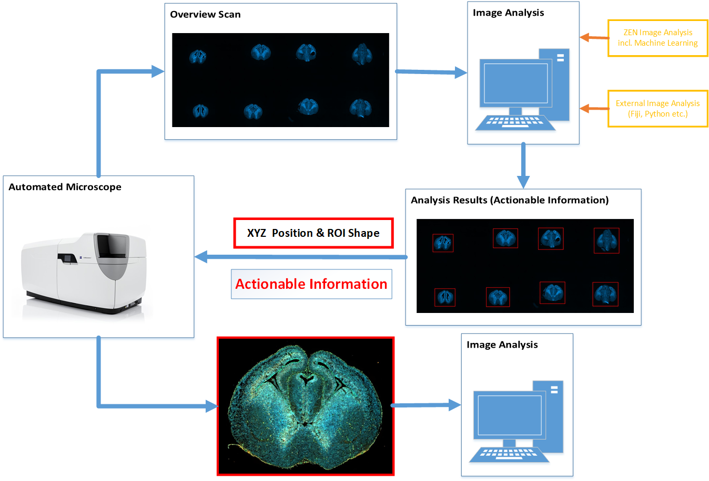
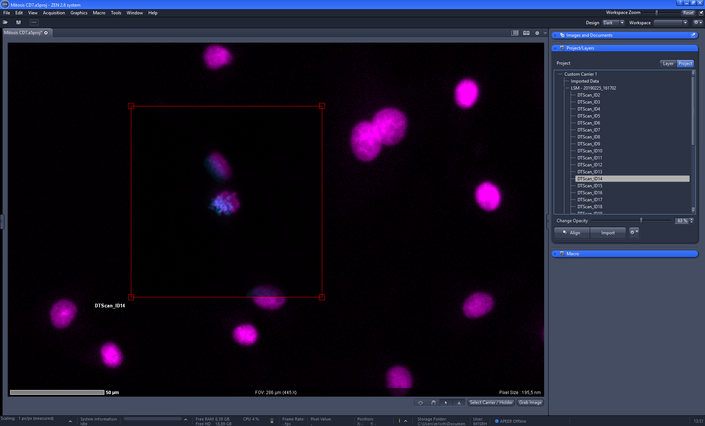

# Guided Acquisition - Use Image Analysis to guide and automate the microscope

## Key Facts

* **Run Overview Experiment**
* **Use Image Analysis to automatically detect "objects"**
* **Modify experiments based on those parameters**
* **Execute the modified experiment for all detected objects**

## General Workflow Description

For a growing number of applications, it will be crucial to acquire data in a smart way. One way to achieve this goal is to build a smart microscope, which essentially means creating smart software workflows to control the hardware based on image analysis results.

**Starting with ZEN blue 3.2 it will also be possible to train you own neural network for segmentation, [import it in ZEN](https://github.com/zeiss-microscopy/OAD/tree/39dbefaaaf4ede1492a4f9c8c12ea56f9b90cb0e/Machine_Learning#importing-externally-trained-networks-into-zen) and use it integrated into the Guided Acquisition workflow.**

### Idea or Task:

* Scan or inspect a large area.
* Detect an "interesting" object or region using automated Image Analysis incl. Machine-Learning Segmentation.
* Acquire detailed data for every event.
* Automate the workflow to minimize user bias.

First of all it is important to define what a **Object of Interest** can actually be. Example would be an object that meets specific criteria, for example:

* Size
* Brightness
* Shape
* Intensity
* Combinations of the above

It could be something quite simple. For instance one can have lots of cells, that are stained with blue dye, and only a few of them (maybe where the transfection worked …) are also expressing GFP.
The idea here would be to detect all cells that are positive for both colors and acquire an z-Stack for every cell that meets those criteria. Therefore this kind of application requires three major tasks:

* **Define the Overview Scan Experiment.**
* **Define the object detection rules, e.g. setup image analysis.**
* **Define the Detailed Scan(s) to be carried out in case of a "positive" object.**

### Main Workflow Description

* Acquire some sample data showing a object of interest.
* Setup an Image Analysis Pipeline to detect those events.
* Define an experiment which does the Overview Scan.
* Define an experiment which does the Detailed Scan.

The goal of this tutorial is to create an automated workflow that can be used to easily setup a **Guided Acquisition**. This requires some knowledge about the OAD macro environment and its **scripting language Python**.

*Workflow Guided Acquisition*

***

## ZEN Module for Guided Acquisition

Starting with ZEN Blue 3.1 there will the option to purchase dedicated software module for Guided Acquisition, which has a streamlined UI interface and other additional functionality, like save settings.

<u>**Key Features**</u> 

* easy-to-use, no need for scripting knowledge
* simple adding of post-processing function for the overview image
* built-in checks if the Image Analysis contains the required parameters
* easy handling of wellplate datasets

  

Add one or more additional image processing steps after the overview scan. This processed image will be the input for the image analysis step. Currently available processing steps:

* Airyscan Processing
* Apotome Processing
* Deconvolution (defaults)
* Shading correction
* Extended depth of focus

Note: You need to define your image analysis setting on a sample image processed with the same parameters

## Supported Hardware

<u>**Supported Hardware**</u>

* Axio Observer Z1/7​
* Axio Imager M1/M2/Z1/Z2​
* Axio Examiner​
* Axioscope 7​
* Axio Zoom.V16​
* Celldiscoverer 7 (with LSM 900)​
* LSM 800 (with Airyscan)​
* LSM 800 MAT​
* LSM 900 (with Airyscan 2)​
* LSM 900 MAT​
* LSM 980 (with Airyscan 2)​
​
> :warning: **This list is subject to change without notice. Please contact your local ZEISS representative for details.**

* **Scanning stage is required for all stands​**
* **Motorized objective nosepiece is recommended​**
* **Definite Focus 2 is recommended for Axio Observer 7**

***

## Application Examples

### Guided Acquisition - Mitosis Detection using camera and LSM

An especially interesting option is to combine the power of a camera-based overview scan with the optional sectioning capabilities of an LSM. Such an workflow can be easily configured in ZEN Blue by setting up the respective experiment for the overview scan with camera detection using a low magnification and the LSM-based detail scan, e.g. Z-Stack, using a high NA objective.

ZEN Blue offers a module called **ZEN Connect**, which allows combining and correlating images inside one sample-centric workspace. Every acquired image by either the camera or the LSM) will be placed here based on the XY stage coordinates. Therefore the **Correlative Workspace (CWS)** is ideally suited to display the results of an Guided Acquisition workflow.

More information about ZEN Connect can be found here: [ZEN Connect](https://www.zeiss.com/microscopy/int/products/microscope-software/zen-connect-image-overlay-and-correlative-microscopy.html)

*Overview Scan inside the Correlative Workspace*

*Overlay of "positive" object and detailed image* 

*Side-by-Side view of overview in CWS and detailed image*

***

### Guided Acquisition - Scan Brain Slides

<figure>
    </figure>

<figure>
    
    <figcaption>Overview image of the sectioned mouse brains and maximum intensity projection of a detected neuron. Sample courtesy of Dr. L. Lim, Katholieke Universiteit Leuven, Belgium</figcaption>
</figure>

<u>**Description**</u>

* Microscope: ZEISS Celldiscoverer 7
* 15 sectioned mouse brains prepared on a standard microscope glass slide
* Nuclei were labeled with DAPI
* Neurons express Tdtomato by low titre retroviral infection
* Overview scan:
  * Plan-Apochromat 5x/0.35 objective, 0.5x magnification changer
  * Axiocam 506 mono
* Image Analysis:
  * segmentation on the neuronal channel
  * Region filter: mean intensity and area 
* Detailed acquisition:
  * Plan-Apochromat 20x/0.95 objective, 0.5x magnification, Airyscan MPLX HS mode and Z-stacks

***

### Guided Acquisition - Scan Drosophila Embryos

<figure>
    
    <figcaption>Overview of the sample and maximum intensity projection of one detected embryo. Sample courtesy of Dr. G. Wolfstetter, University of Gothenburg, Germany</figcaption>
</figure>

<u>**Description**</u>

* Microscope: ZEISS Celldiscoverer 7
* Sample: Fixed drosophila embryos on a standard microscope glass slide
* Visceral muscles were labeled with Alexa 488 CUT (one type of homeodomain transcription factor) was labeled with Cy3
* Overview scan:
  * Plan-Apochromat 5x/0.35 objective, 0.5x magnification changer, Axiocam 506 mono
* Image Analysis:
  * performed on the gut structure, where green positive embryos were detected first by mean intensity of Alexa488
  * filtered by geometric features to identify those with preferred lateral orientation
* Detailed acquisition:
  * Plan-Apochromat 20x/0.95 objective, 0.5x magnification changer, Airyscan MPLX HS mode and Z-stacks

***

### Guided Acquisition - Detection of cell-cell contact

<figure>
    
    <figcaption>Inset shows cell-cell contact between two U20S cells expressing late endosome (green) and actin (purple) markers. Sample obtained from ZEISS Oberkochen demo lab.</figcaption>
</figure>

<u>**Description**</u>

* Microscope: ZEISS Celldiscoverer 7
* Sample:
  * mammalian U2OS cells expressing cells expressing late endosome (Rab5-mEmerald)
  * actin (lifeAct-tdTomato) marker
  * no marker
  * cells are counter-stained with Hoechst33342
* Overview scan:
  * 10x 0.5 dry (20x 0.95, 0.5x Magnification Changer)
* Image Analysis:
  * segmentation of green cells
  * dilation of those cells
  * region filter for area and red intensity in the green cells
* Detailed acquisition:
  * 25x 1.2 W autoimmersion (50x 1.2, 0.5x Magnification Changer)
  * Mixed Mode:
    * Airyscan HS (mEmerald, tdTomato)
    * DAPI and Oblique Contrast in WF 

### Guided Acquisition - Detection of organoids

<figure>
    
</figure>

<figure>
    
    <figcaption>Overview of a well of a 24-well plate, the overview image and the detail scans. Sample courtesy of Dr. M. Lutolf, EPFL, Switzerland</figcaption>
</figure>

<u>**Description**</u>

* Microscope: ZEISS Celldiscoverer 7
* Sample:
  * mouse Lgr5+ gut organoids in a 24 well thick PS-bottom plate
  * organoids mounted in 3D matrix (matrigel)
* Overview scan:
  * 2.5x 0.12 dry (5x 0.35, 0.5x Magnification Changer)
  * DAPI channel only
* Image Analysis:
  * segmentation of organoids from DAPI overview scan
  * region filter on organoid size, intensity and circularity of objects
* Detailed acquisition:
  * 10x 0.35 (20x 0.7, 0.5x Magnification Changer)
  * auto-adapted for thick-PS bottom imaging
  * 3 Channel, single track LSM for speed
  * z-stacks

***

### Guided Acquisition - Detection of mitotic cells

<figure>
    
    <figcaption>Overview of the sample and one location with a mitotic cell, identified with image analysis and scanned with high resolution. Sample obtained from ZEISS Oberkochen demo lab.</figcaption>
</figure>

<u>**Description**</u>

* Microscope: ZEISS Celldiscoverer 7
* Sample: Porcine kidney cell line LLC-PK1
* Sample holder: cell culture in a 35 mm glass bottom petri dish
* Sample:
  * Nuclei labeled with Histone 2B mCherry
  * Microtubles labeled with tubulin mEmerald
* Overview scan:
  * Plan-Apochromat 5x/0.35 objective, 1x magnification changer,Axiocam 506 mono; 
* Image Analysis:
  * segmentation on nuclear channel
  * Region Filter: intensity and area were set to detect the mitotic cells.
* Detailed scan:
  * Plan-Apochromat 50x/1.2 water immersion objective, 0.5x magnification changer
  * Airyscan MPLX HS mode

***

## Guided Acquisition using the python script (OAD)

The "scripted" version of Guided Acquisition comes free of charge, but requires more knowledge and can be used at your own risk.

<u>**Key Features**</u> 

* full flexibility
* allows extending and customization for the advanced users
* add you own processing steps
* use APEER (on-site) modules (Docker Containers) to run the image analysis
* invoke external software packages to do the image analysis

### Integration with external Image Analysis

* in combination with **[APEER (on-site)](https://github.com/zeiss-microscopy/OAD/tree/a822058bc124c5181f792abd2b383a8e72d6ae0f/Apeer)** it is possible to integrate your own image analysis packaged into Docker containers
* an advanced option would be to start or call **[external application directly from within ZEN python scripts](https://github.com/zeiss-microscopy/OAD/tree/a822058bc124c5181f792abd2b383a8e72d6ae0f/Scripts/Start_External_Software)** as explained here

***

***

*Guided Acquisition using scripting*

***

### Detailed WorkFlow Diagram for Guided Acquisition

*General Worklow diagram for Guided Acquisition*

***

## Disclaimer

> :warning: **This is an application note that is free to use for everybody. Use it on your own risk. Especially be aware of the fact that automated stage movements might damage hardware if the system is not setup properly. Please check everything in simulation mode first!**
>
> Carl Zeiss Microscopy GmbH's ZEN software allows connection to the third party software, Python. Therefore Carl Zeiss Microscopy GmbH undertakes no warranty concerning Python, makes no representation that Python will work on your hardware, and will not be liable for any damages caused by the use of this extension. By running this example you agree to this disclaimer.
